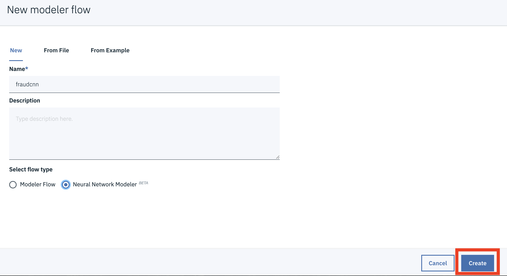
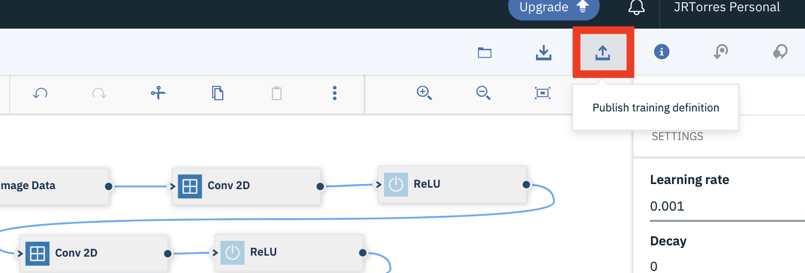
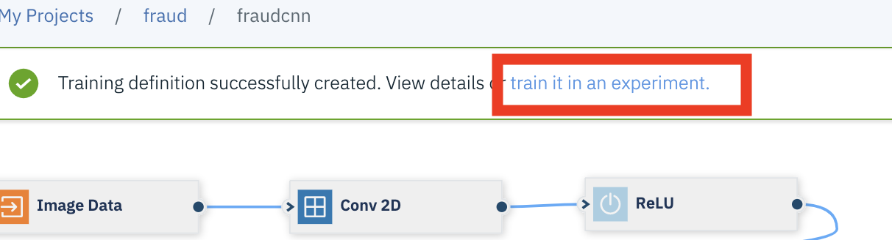

# Build and Deploy an Neural Network model using Modeler

In this walkthrough we will be building a model using a visual model building tool. The flow of this walkthrough is:

- Create a project.
- Create a modeler flow.
- Save the model.

The instructions were adapted from the more comprehensive tutorial found here - https://developer.ibm.com/tutorials/create-and-experiment-with-dl-models-using-nn-modeler/

## Included components

- [IBM Watson Studio](https://www.ibm.com/cloud/watson-studio): Analyze data using RStudio, Jupyter, and Python in a configured, collaborative environment that includes IBM value-adds, such as managed Spark.

### Prerequisites

- It is assumed you have your environment set up with either lite or payed versions of Watson Studio and Watson Machine Learning. If not, contact the lab instructor or set up your own lite instances as detailed in the [Setup Environment readme](SetupWatsonStudio.md)

## Step 1: Setup Project and Data

1. Open Watson Studio by logging in at [https://dataplatform.ibm.com](https://dataplatform.ibm.com)

1. From the dashboard page, Click on the **`Create a project`** tile to create a new project in Watson Studio.

    

1. Select `Create an empty project` as the type of project to create.

1. Give your project a name, for example `NNModeler`, and click **`Create`** on the bottom right.

    

1. Next we have to associate a Watson Machine Learning service to the project. 
    - Click on `Settings` tab on the top banner of the project, 
    - then `Add Service` under `Associate Services` and 
    - finally, select `Watson` to add a Watson service to the project.

    

1. Select `Add` link in the `Machine Learning` tile from the list of available Watson Services.

    

1. Click on the `Existing` tab and select the name of your Machine Learning service instance.

    
  
1. The Watson Machine Learning service is now listed as one of your `Associated Services`.

## Step 2: Create Modeler Flow

> To avoid potential browser cache problem, it's recommended to use Chrome browser in `Incognito` mode. Otherwise, you may encounter `502 Bad Gateway` error.

1. From your main project page, Click the **`Add to project`** button and select the `Modeler Flow` option.

    

1. Give the new flow a name, for example `NNModeler-flow`, 
    - Select the `Nueral Network Modeler` radio button and 
    - click the **`Create`** button.

    

1. You’ll drop into the Modeler Canvas. This is where you’ll build your Neural Network graphically instead of using code.The panel on the left is a palette of all the nodes you can use in your model building, which you can drag and drop onto the main canvas.

1. First we add the input to our network. 
    - Select `Image Data` from the `Input` section of the palette and Drag / drop the node on to the canvas. 
    - Then double-click the new node to modify its properties (properties for nodes show up as a panel on the right side of the screen) 

    

1. To add our input data, we have to create a new connection to your Object Storage instance (COS) where our data resides. 
    - Click the `Create a New Connection` option under the Data sction, or select a connection if one already exists. 
    - You will then be able to choose the bucket that contains your train / test /validation data assets, 
    - and then choose the `training_data.pickle` file as the Training data file, `test_data.pickle` as the Test data file and `validation_data.pickle` as the Validation data file.

    

1. Now expand the "Settings" section of the right panel, and modify the input parameters as shown in the screen shot below.

    

    We are using 32x32 images with 1 channel (grayscale), 2 classes, and using python pickle file formats. _Note:_ Epoch is the number of iterations the network will train each batch. And batch is the number of images being fed to the network at one time.

1. Click the **`Close`** button

1. Now lets build our network layers. Add a convolutional layer by dropping in a `Conv2D` node and an activation layer by dropping in a `ReLU` node. Wire the three nodes together by clicking on the circles on each node and drawing a line between them

    

1. Double click on the first conv2d node and set the following parameters as shown in the two screenshot below.

    - We are setting the number of filters (number of feature maps) to 32, these filters will be 3x3 moving with a stride of 1. 
    - WE are also setting the learning rate multiple (value to modify learning rate for each layer) and decay multipler (value to modify decay rate for each layer) for both the weight and bias to 10 and 1 respectively.
    - *Note* We are only modifying some of the possible parameters. Others we leave with default values are ones you can explore changing in the future. Some of these might also be hyper parameters we choose to optimize. 

    

    

1. Once you have all these settings in place, click the **`Close`** button 

1. Add another layer. Again drop in a Conv2D node with a ReLU activation function

    

1. Double click the second conv2d node and this time set the parameters to:
    - Set Number of filters to 64
    - Set Kernel row to 3
    - Set Kernel col to 3
    - Set Stride row to 1
    - Set Stride col to 1
    - Set Weight LR multiplier to 1
    - Set Weight decay multiplier to 1
    - Set Bias LR multiplier to 1
    - Set Bias decay multiplier to 1

1. With two convolutional layers, we next add a pooling layer to reduce the dimensionality of the features extracted. We will add a Max Pooling layer, which reduces the features by taking the maximum value within a window. Max pooling is a common approach that reduces the amount of data by extracting the most dominatn features.

1. Drag and drop a Pool 2D node from the Convolutional section and wire it to the second reLU node, then double click the Pool2D node and set the values as shown in the screen shot (in our case we are using a 3x3 kernel that moves 1 space across and 1 down at a time). Then click the close button.

    

1. To prevent overfitting, we can add in a dropout to our network (deactivates nodes in a layer with a certain probability during training). Drag and drop a `Dropout` node from the Core section in the left sidebar, then double click on it and set the probablity to .25

    

1. We now start to flatten our dimensions and add a fully connected network to start getting to our desired output. Drag and drop a `Flatten` node from Core section, then Drag and drop a `Dense` node from Core section in the left sidebar. Connect them together and set the dense layer to 128 nodes (leave other parameters as default)

    

1. Add another `Dropout` node and change the "Probability" of this layer to 0.5.

1. Add a final `Dense` node. This will represent the output classes, two in this case (fraudulent or not). Double click the node and change the number of nodes in the settings to 2 and click Close.

    

1. To complete the network, we add an activation layer at the end of our architecture. Drag and drop a Softmax node to the canvas and connect it to final Dense node. Softmax will return an output in the range of [0, 1] to represent true and false values for each node in the final layer.

    

1. In order to calculate the performance of the model, we need to add in a loss function (error of models prediction). Drag and drop a `Cross-Entropy` node from the Loss section in the left sidebar. We also want to calculate the accuracy of the model, so Drag and drop the Accuracy node from the Metrics section. Wire both nodes to the output of the Softmax node.

    

1. Finally, we’ll add an optimization algorithm which is used to modify parameters to minimize loss during training iterations. In this case, drag and drop the `Adam` node from Optimizer section in the left sidebar. Then double click the Adam node and set the learning rate to 0.001 and the decay to 0 (since the Adam algorithm changes learning rate during training we do not need a decay). Leave the other values to their defaults. Wire the Adam node to the Cross-Entropy loss node.

    

1. With our model built, we can now publish and train it. Click on the `Publish training definitions` button on the top of the canvas

    

1. Give the model a name and ensure you machine learning service is detected, then click the `Publish` button

    

1. A notification will show on the top of the screen when the model is published. When its there, click on the link to `train it in an experiment`

    

1. Give the experiment a name and click the `Select` button to select the training data files

    

1. Select your cloud object storage connection and the existing bucket where you have the training pickle file.

    

1. Back on the experiment details page, click the `New` radio button to add the bucket for our training results. Select your cloud object storage connection but this time use a new bucket, give your bucket a unique name (i.e something with your initials and date) and then click the `Select` button

    

1. Click on Add training definition link in the right side of the page. and select the Existing training definition tab. Select the training definition from the dropdown list according to the name you gave it previously. Select the hardware configuration shown and then click on Select at the bottom of the page. We are not doing HPO here but feel free to read the full tutorial for defining an HPO experiment

    

1. Click the `create and run` button to kick off the experiment.

1. You will see the experiments execute, though this may take some time to complete.

    

1. Feel free to explore the code by going back to the modeler canvas and selecting to Download the code.
