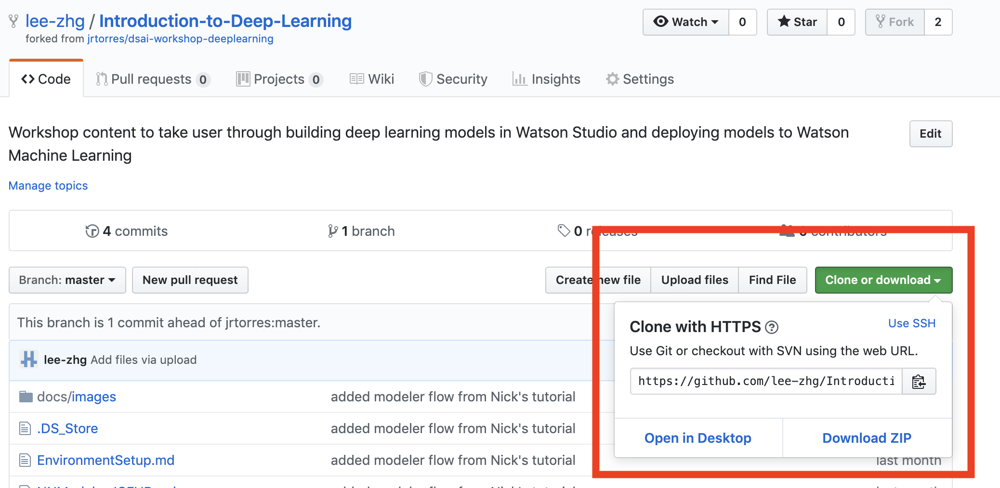

# Data & AI Workshop - Deep Learning

## Objective

This workshop will walk you through some of the fundamental early stages of the Data Science / ML workflow. We will be exploring different aspects of data understanding, visualization and processing. By the end of these labs/tutorials, you should understand:

- The use of Jupyter Notebooks in IBM Watson Studio
- How to load data sets with open source libraries
- How to visualize data sets through code and no-code options
- How to process data sets

### Tools Used

- Watson Studio [(docs)](https://dataplatform.cloud.ibm.com/docs/content/wsj/getting-started/welcome-main.html?audience=wdp)
- Watson Machine Learning [(docs)](https://developer.ibm.com/clouddataservices/docs/ibm-watson-machine-learning/get-started/)
- [Jupyter Notebooks](http://jupyter.org/)
- [Scikit Learn](https://scikit-learn.org/)
- Several Python Libraries: Pandas, Seaborn, Matplotlib, [PixieDust](https://github.com/pixiedust/pixiedust)

## Requirements

- [IBM Cloud Account](https://cloud.ibm.com)

***

## Workshop Flow

Most of these labs are written in python and using Jupyter Notebooks. One of the most common python libraries used for data analysis and manipulation is [pandas](https://pandas.pydata.org/), which is used throughout the labs. For a quick tutorial around pandas, feel free to run through the material found here - [IBMDeveloperUK pandas-workshop](https://github.com/IBMDeveloperUK/pandas-workshop).

### Prerequisites

1. Store this repository on your local computer.

   If you have GIT on your machine, clone this repository locally. Open a terminal and run:

   ```
   $ git clone https://github.com/jrtorres/dsai-workshop-machinelearning.git
   ```

   If you do NOT have GIT on your machine, you can just download the repository as a ZIP file. In the browser window, select :

    

1. Ensure you have access to a Waston Studio Instance. If you need to provision an instance, see the instructions in the [Setup Watson Studio doc](SetupWatsonStudio.md)

### Lab 1 - Building A Deep Learning Model Using Code

Lab 1

### Lab 2 - Building A Deep Learning Model Using Visual Assembly

Lab 2

### Lab 3 - Running an Experiment

Lab 3

### [Optional] Lab 4 - NeuNetS

Lab 4

## General Links

- [IBM Developer](https://developer.ibm.com)
- [Watson Studio](https://dataplatform.ibm.com/)
- [Watson Studio Overview](https://dataplatform.cloud.ibm.com/docs/content/wsj/getting-started/overview-ws.html?audience=wdp&context=wdp&linkInPage=true)
- [Watson Machine Learning Python SDK](https://wml-api-pyclient.mybluemix.net/)
- [Watson Studio Video Learning Center](https://www.youtube.com/playlist?list=PLzpeuWUENMK3u3j_hffhNZX3-Jkht3N6V)
- [Data Science Code Patterns](https://developer.ibm.com/code/technologies/data-science/)
